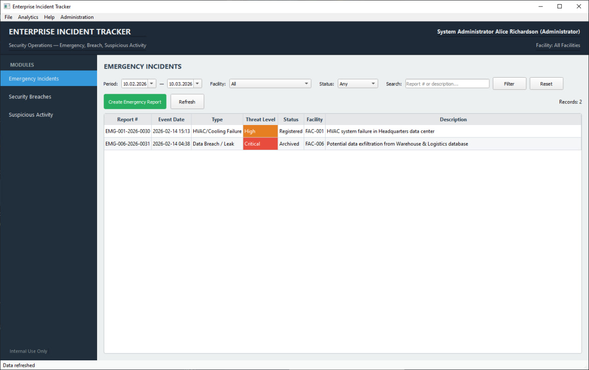
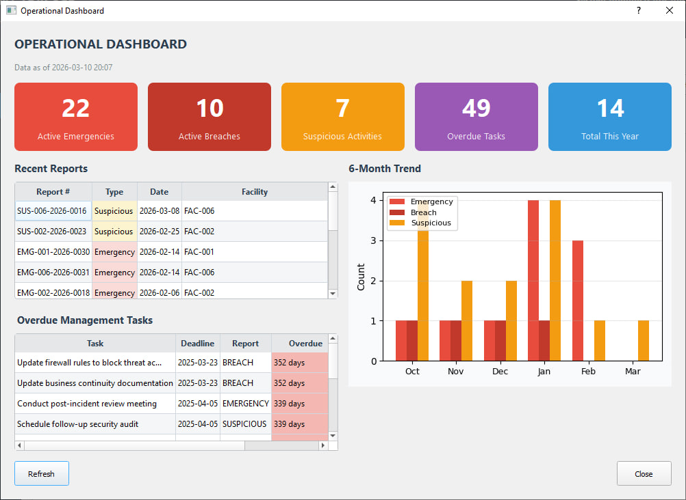
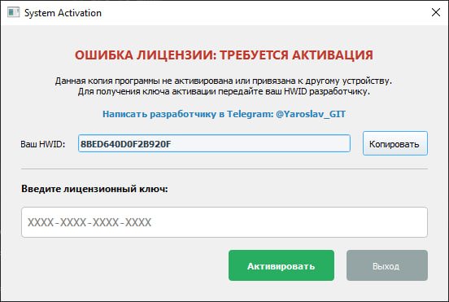
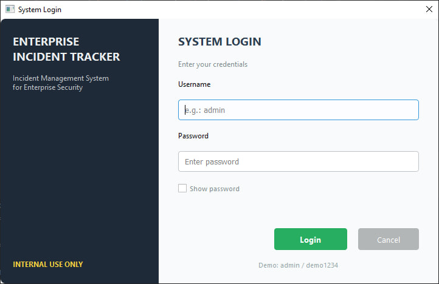
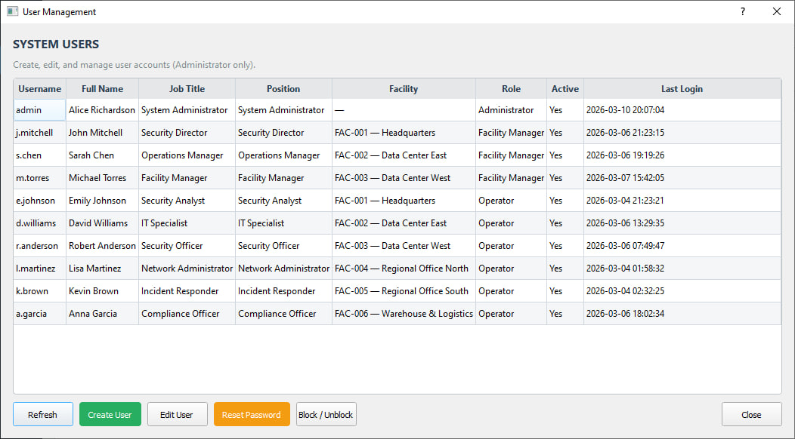
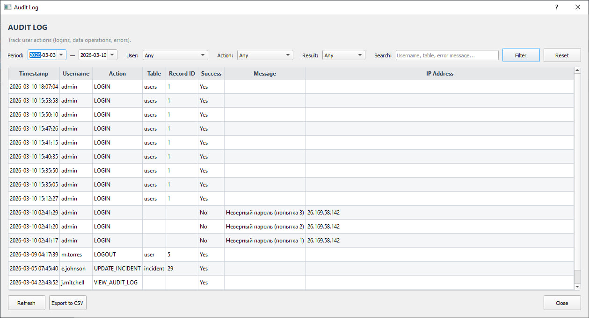
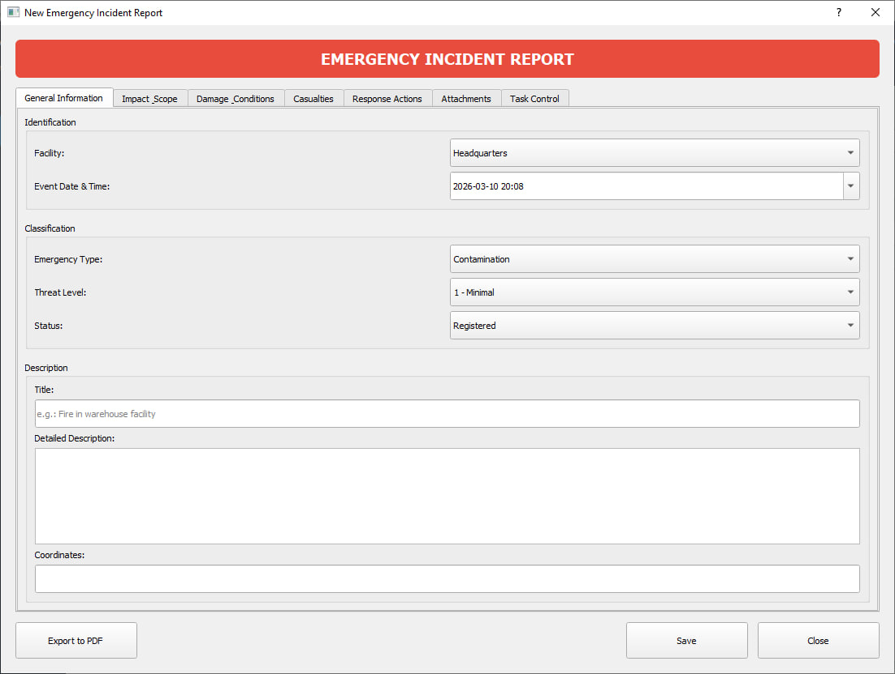

# 🛡️ Enterprise Incident Tracker
**Комплексное десктопное решение для управления корпоративной безопасностью**

*Автоматизация работы служб безопасности (СБ), ЧОП и управляющих компаний. Забудьте о потерянных бумажных рапортах и хаосе в Excel.*

[Связь с разработчиком (Telegram)](https://t.me/Yaroslav_GIT) • [Скачать Demo](https://github.com/YYaroslavSSolovev/Enterprise-Incident-Tracker/releases/tag/v1.0.0)

---

## 📸 Интерфейс системы

  <h3>1. Рабочее пространство (Main & Dashboard)</h3>
  
  <!-- СКРИНШОТ 1: Главное Окно (Main Window) -->
  
  
<i>Единое окно для управления всеми модулями (Emergency, Breach, Suspicious Activity)</i>

   

  <!-- СКРИНШОТ 2: Окно Дашборда (Dashboard) -->
  
  
<i>Интерактивный Dashboard: мониторинг активных инцидентов и просроченных задач в реальном времени</i>

 
 

  <h3>2. Безопасность и Вход (Security)</h3>
  <table style="border: none;">
    <tr>
      <td align="center" width="50%">
        <!-- СКРИНШОТ 3: Окно лицензии (HWID) -->
        
         <i>Привязка к оборудованию (HWID Protection)</i>
      </td>
      <td align="center" width="50%">
        <!-- СКРИНШОТ 4: Окно аутентификации (Login) -->
        
         <i>Защищенный вход (Bcrypt Auth)</i>
      </td>
    </tr>
  </table>

 
 

  <h3>3. Администрирование (Administration)</h3>
  <table style="border: none;">
    <tr>
      <td align="center" width="50%">
        <!-- СКРИНШОТ 5: Окно управления пользователями (Users) -->
        
         <i>Role-Based Access Control (Управление ролями)</i>
      </td>
      <td align="center" width="50%">
        <!-- СКРИНШОТ 6: Окно аудита (Audit Log) -->
        
         <i>Audit Log (Контроль действий персонала)</i>
      </td>
    </tr>
  </table>

 
 

  <h3>4. Учёт инцидентов (Reporting)</h3>
  <!-- СКРИНШОТ 7: Форма репорта (Report Form) -->
  
  
<i>Многовкладочная форма создания рапорта (фиксация ущерба, задач, потерь и вложений)</i>

---

## 💼 Почему бизнесу нужна эта система?

До 70% важной информации об инцидентах на объектах теряется из-за человеческого фактора или использования разрозненных мессенджеров. **Enterprise Incident Tracker** решает эту проблему:

* ⏱️ **Отчеты за 1 клик:** Автоматическая генерация профессиональных PDF-рапортов с QR-кодами для руководства.
* 🔒 **Абсолютная конфиденциальность:** Программа работает полностью **offline**. Данные не передаются в облако и хранятся в защищенной локальной базе (SQLite).
* 👁️ **Защита от саботажа:** Встроенный *Audit Log* фиксирует каждый клик. Сотрудник не сможет удалить инцидент или подменить данные незаметно.
* 🎯 **Контроль поручений:** Встроенный таск-трекер для отслеживания реакций на инциденты (кто должен устранить последствия и в какой срок).

---

## ✨ Ключевой функционал

### 1. Учет трех типов инцидентов
* **🚨 Emergency Incidents (ЧС)**: Фиксация аварий, ущерба и потерь.
* **🛡️ Security Breaches (Нарушения периметра)**: Учет попыток проникновения и действий нарушителей.
* **👁️‍🗨️ Suspicious Activity (Подозрительная активность)**: Работа на опережение и планирование усиления охраны.

### 2. Строгая ролевая модель (RBAC)
* **👑 Administrator**: Полный доступ. Управление пользователями, аудит, снятие блокировок.
* **🏢 Facility Manager**: Доступ только к отчетам своего объекта + аналитика.
* **👨‍💻 Operator**: Режим "read/write" только для своего объекта без доступа к настройкам.

### 3. Защита файлов и вложений
Возможность прикреплять к рапортам фотографии и документы. Система автоматически проверяет файлы на целостность алгоритмом `SHA-256`, исключая подмену доказательств.

---

## 🛠 Технологии под капотом (Для IT-специалистов)

* **UI Layer:** PyQt5 (строгий корпоративный интерфейс, нативная отрисовка).
* **Data Layer:** Чистый SQL (SQLite3) с использованием Prepared Statements (нулевой риск SQL-инъекций). Никаких тяжелых ORM.
* **Cryptography:** `bcrypt` (12 раундов) для паролей, `hashlib` для файлов, `secrets` для генерации.
* **Security:** Программная защита от Brute-Force атак (таймаут после 5 попыток).
* **Compiler:** Бинарная компиляция через `Nuitka` (C-level). Исходный код недоступен для реверс-инжиниринга.

---

## 📥 Скачать Демо-версию

Данный программный комплекс является **коммерческим продуктом**. Исходный код закрыт.

Вы можете бесплатно протестировать работу системы:
1. Перейдите в раздел [**Releases**](https://github.com/YYaroslavSSolovev/Enterprise-Incident-Tracker/releases) (справа).
2. Скачайте архив `Enterprise_Tracker_Win64.zip` и распакуйте его на ПК с Windows.
3. Запустите файл `.exe`.
4. Система выдаст вам уникальный идентификатор вашего оборудования (**HWID**).
5. Напишите мне в Telegram и отправьте HWID — я выдам вам **бесплатный тестовый ключ**.

---

## 🤝 Заказ разработки и покупка ПО

Я открыт для B2B сотрудничества и фриланс-заказов. 

Что я предлагаю:
* 🛒 **Покупка готовой системы** (выдача безлимитных лицензий на ваши ПК).
* ⚙️ **Кастомизация ПО** под бизнес-процессы вашей компании (добавление ваших логотипов, новых типов отчетов, интеграция с вашими серверами).
* 💻 **Покупка исходного кода** (Source Code) для вашей in-house команды разработки.
* 🛠️ **Разработка десктопного ПО с нуля** на Python (PyQt/PySide).

**Свяжитесь со мной для обсуждения проекта:**

💬 **Telegram:** [@Yaroslav_GIT](https://t.me/Yaroslav_GIT)  

 

  <i>Enterprise Incident Tracker © 2026. All Rights Reserved.</i>

